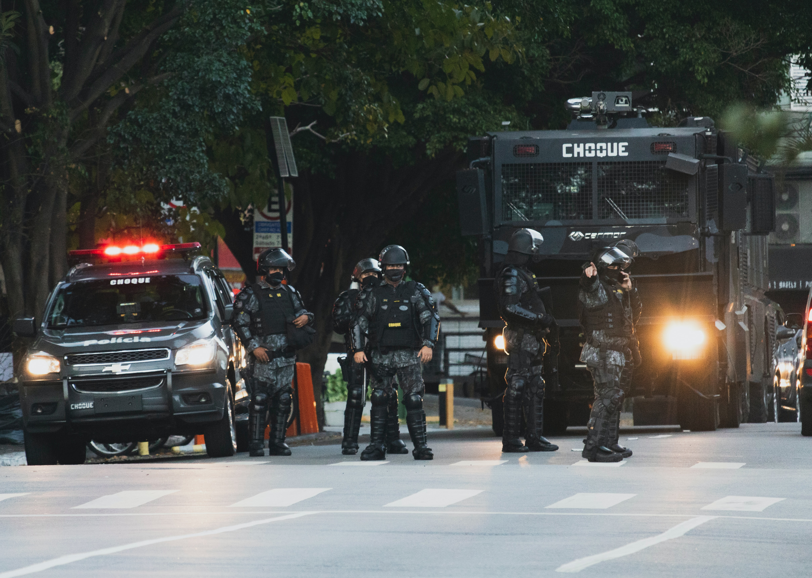

[](https://www.linkedin.com/in/gabrielhermsen/)
[](https://docs.python.org/3.9/)
[](http://perso.crans.org/besson/LICENSE.html)
[](https://github.com/ghermsen/sao_paulo_murder_eda/issues)

# Exploratory Data Analysis of São Paulo's Policy Murder Reports

According to the [WHO, World Health Organization](https://www.who.int/data/gho/data/indicators/indicator-details/GHO/estimates-of-rates-of-homicides-per-100-000-population) (date of view 03.18.2021), Brazil has a homicide rate of 32.59 per 100 thousand inhabitants, a rate five times higher than the global average (6 for every 100 thousand inhabitants), putting the country on the 9th position in this sad statistic.

Brazil is a vast country, with more than 200 million inhabitants and divided by 27 federative units, with extreme inequality. An excellent example of these inequalities is the homicide rate of these states that the [Atlas of Violence](https://www.ipea.gov.br/atlasviolencia/arquivos/artigos/3519-atlasdaviolencia2020completo.pdf) (p.18) reported. This report shows us that in 2018, Roraima state had the highest homicide rate in the country, 71.8 homicides per 100 thousand inhabitants. In contrast, São Paulo state had the lowest homicide rate in the country, with only 8.2 homicides per 100 thousand inhabitants.

In this work, an Exploratory Analysis of the police reports referring to homicides in the state of São Paulo will be carried out between the years 2018 and 2020.

<br><center></center>
Photo by [Marília Castelli](https://unsplash.com/@liacastelli?utm_source=unsplash&amp;utm_medium=referral&amp;utm_content=creditCopyText) on [Unsplash](https://unsplash.com/s/photos/sao-paulo?utm_source=unsplash&amp;utm_medium=referral&amp;utm_content=creditCopyText)

---

## Imports

Below there are all the libraries used in this project.

* `NumPy`
* `Matplotlib`
* `Pandas`
* `PyWaffle`

---

## Obtaining the Data

All data used in this project is on the website of the [Secretary of Public Security of the State of São Paulo](http://www.ssp.sp.gov.br/transparenciassp/).

For this Exploratory Data Analysis, the following files were downloaded and merged in one single file:

* Downloaded Files
    * Category - Homícidio doloso **(murder, willful homicide)**
    * Period - Every month between Jan 2018 and Dec 2020

* Repository File
    * Path - [https://github.com/ghermsen/sao_paulo_murder_eda/tree/main/db](https://github.com/ghermsen/sao_paulo_murder_eda/tree/main/db)
    * File - [https://raw.githubusercontent.com/ghermsen/sao_paulo_murder_eda/main/db/dadosbo.csv](https://raw.githubusercontent.com/ghermsen/sao_paulo_murder_eda/main/db/dadosbo.csv)
    
***Note: With the intent of preserving the victims' identities, I already deleted the victims' personal information after processing the data. For this reason, the following analysis shows only data processing with the dataset left after the anonymization of the victims.***

---

## Understanding the Dataset

Understanding the data is a fundamental step in any data science project. This process will show us the variables available in the dataset and how these variables are structured. This step helps us understand the type of problem and how we will solve it.

### Variables' Dictionary

* `date` - the date that the murder occurred.
* `time` - the time that the murder occurred.
* `period` - the period of the day that the murder occurred.
* `city` - the city where the murder occurred.
* `region` - the administrative region that the city belongs to.
* `police_station` - the police station that registered the murder.
* `gender` - victim's gender.
* `age` - victim's age.
* `ethnicity` - victim's ethnicity (classification used by [IBGE](https://educa.ibge.gov.br/jovens/conheca-o-brasil/populacao/18319-cor-ou-raca.html)).

We can now check the first five entries of the dataset to better understand the data.
<p align="center">
    
</p>

### Dataset Size and Type of Variables

Below, you can see the size of the dataset and the types of its variables.

```python
# checking dataset's size and number of variables

print(f'Number of Entries:\t {df_raw.shape[0]}')
print(f'Number of Variables:\t {df_raw.shape[1]}')

# types of variables

df_raw.dtypes


    Number of Entries:	 11793
    Number of Variables:	 9


    date              object
    time              object
    period            object
    city              object
    region            object
    police_station    object
    gender            object
    age                int64
    ethnicity         object

    dtype: object
```
It can be observed that the `date` and `time` variables are `object`. As these variables represent time, these variables passed for a process of merging and then transformed into `datetime64[ns]`.

```python
# changing type of date and time variables

df_raw.date = df_raw.date.map(str) + " " + df_raw.time
df_raw = df_raw.drop('time', axis = 1)
df_raw.date = pd.to_datetime(df_raw.date)
df_raw.dtypes

    date              datetime64[ns]
    period                    object
    city                      object
    region                    object
    police_station            object
    gender                    object
    age                        int64
    ethnicity                 object
    dtype: object
```

### Cleaning the Dataset

Looking at the Variables’ Dictionary and the types of variables presented in the dataset, it is possible to see a variable not relevant for the analysis, which is `police_station`. For a cleaner and more objective analysis, I deleted this variable.

```python
# deleting column police_station

df_raw.drop('police_station', axis = 1, inplace = True)
```


### Missing Values

The quality of a dataset is directly related to the number of missing values. It is important to understand early on whether these null values are significant concerning the total number of entries to avoid future problems in our analysis.

```python
# deleting column police_station

# checking missing values

((df_raw.isnull()).sum() / df_raw.shape[0]).sort_values(ascending = False)

    date         0.0
    period       0.0
    city         0.0
    region       0.0
    gender       0.0
    age          0.0
    ethnicity    0.0
    dtype: float64
```

### Feature Engineering

In this project, I will create variables derived from existing variables to assist future analyses. The variables will be the following:

* `year` - the year that the murder occurred.
* `month` - the month that the murder occurred.
* `day` - the day that the murder occurred.
* `hour` - the hour that the murder occurred.
* `day_of_week` - the day of the week that the murder occurred.
* `weekend` -  if the day of the week is a weekend (Saturday or Sunday), the value is equal to 1. If it is not, the value is equal to 0.
* `age_group` - the age group that the victim belongs to.

After this process, the data frame is ready for analysis.

```python
# feature engineering for year, month, day, hour, day_of_week and weekend variables

df_raw['year'] = df_raw.date.dt.year
df_raw['month'] = df_raw.date.dt.month
df_raw['day'] = df_raw.date.dt.day
df_raw['hour'] = df_raw.date.dt.hour
df_raw['day_of_week'] = df_raw.date.dt.day_name()
df_raw['weekend'] = 0
df_raw.loc[(df_raw.day_of_week == "Saturday") | (df_raw.day_of_week == "Sunday"), 'weekend'] = 1

# feature engineering for age_group variable

bins = [0, 10, 20, 30, 40, 50, 60, 70, 120]
labels = ['0-9', '10-19', '20-29', '30-39', '40-49', '50-59', '60-69', '70+']
df_raw['age_group'] = pd.cut(df_raw.age, bins, labels = labels, include_lowest = True, right = False)
df_raw['age_group'] = df_raw['age_group'].cat.add_categories('unknown').fillna('unknown')
df_raw.sample()
```
<p align="center">
    
</p>

---

## Data Analysis

The data analysis will address territorial, social and temporal aspects:

- **Territorial**
    - State of São Paulo
        1. What is the total number of victims of murder in São Paulo state during 2018, 2019, and 2020?
        2. What is the total change of victims of murder between the years analyzed?
    - Administrative Regions
        1. What is the distribution of the number of victims of murder among the different regions of São Paulo state?
        2. What is the total change of victims of murder among the regions of São Paulo state between the years analyzed?
- **Social**
    - Gender
        1. What is the leading gender of the victims?
        2. What is the percentual difference in the victims of murder between the years by gender?
    - Ethnicity
        1. What is the leading ethnic group of the victims?
        2. What is the percentual difference in the victims of murder between the years by ethnic group?
    - Age Group
        1. What is the leading age group of the victims?
        2. What is the percentual difference in the victims of murder between the years by age group?
    - Victims' Profile
        1. What are the main profiles of male and female victims?
- **Temporal**
    - What is the month with the most victims of murder?
    - What is the day with the most victims of murder?
    - Which period of the day has more victims of murder?
    - What is the hour of the day with the most victims of muder? Are there differences between the hours on weekdays and weekends?

### Territorial Analysis


The state of São Paulo has a total size of 248,209 km², and if we compare the size of the state of São Paulo with a country, it would be slightly larger than the United Kingdom, which has 242,495 km². According to [SEADE](http://www.imp.seade.gov.br/frontend/#/tabelas), in 2020, São Paulo state had 44.63 million inhabitants in 645 municipalities.

The data show that 505 cities registered victims of murder in the state during the analyzed period, and only 140 cities did not register any victim of murder in this period.

### State of São Paulo


As seen above, in São Paulo, 505 cities registered victims of murder in the analyzed period. When we check the number of victims, we get a total of 11,793 victims of murder.

An analysis year by year shows that the numbers have been falling over the last three years, with a drop of 3.65% in 2019 and a drop of 4.03% in 2020, resulting in a decrease of 7.52% of the number of victims of murder.

<p align="center">
    
</p>

### Administrative Regions of São Paulo

Above, I carried out an analysis of the numbers throughout the whole state of São Paulo. However, according to police reports of the Secretary of Public Security of the State of São Paulo, the São Paulo state is divided into 12 regions.

```python
# regions of são paulo state

df.region.sort_values(ascending = True).unique()

    array(['Araçatuba', 'Bauru', 'Campinas', 'Capital', 'Grande São Paulo ',
           'Piracicaba', 'Presidente Prudente', 'Ribeirão Preto', 'Santos',
           'Sorocaba', 'São José do Rio Preto', 'São José dos Campos'],
          dtype=object)
```

Now that we know all the administrative regions in São Paulo state, it is possible to see a big difference in these regions' total number of victims. This difference occurs because some regions are much more populous than others.


The image on the left side shows the difference between the Capital region's total numbers and the Presidente Prudente region. However, the Capital region has approximately 12 million inhabitants, whereas the Presidente Prudente region has around 860 thousand inhabitants.

For this reason, in the analysis by region, an analysis of the percentage value will show us much more relevant information than an analysis of the total values by region.

In the percentage results, we noticed three regions (Piracicaba, Bauru, and Araçatuba) where the number of victims of murder has increased in recent years. In contrast, in the other regions, the number of victims has fallen. The regions with the most significant declines are Presidente Prudente, São José do Rio Preto and Santos.

<p align="center">
    
</p>

---

### Social Analysis

Before carrying out an analysis based on social aspects, it is essential to understand how the São Paulo state population is composed. Usually, in Brazil, a census is carried out every ten years, and the last census was carried out only in 2010 due to the COVID-19 pandemic. Thus, the numbers referring to population gender, ethnicity, and age grouping are unofficial projections.

### Gender


According to SEADE, in 2020, São Paulo's population was 44,639,899 inhabitants, 48.67% men and 51.33% women.

We can see that 10,388 victims of murder are male during the period analyzed, and 1,405 victims are female in São Paulo state.

Through the total numbers of victims by gender, it is possible to see that even though the percentage of the female population in São Paulo is higher than the male population, there is a big difference in the number of victims of murder in the state, with 88% of male victims and 11% of female victims.

<p align="center">
    
</p>


However, to understand better the evolution in the number of victims per gender, I analyzed the number of victims per year. The analysis showed that the number of victims from both genders has been falling year after year. At the end of the period, the number of female victims showed a significant drop of 15.98% against a drop of 6.92% of male victims.

<br>

### Ethnicity

Brazil is a multiracial country, and in its census, the population is divided into five ethnic groups: Asian, Black, Indigenous, Parda (Multiracial), and White.

According to SEADE, in 2010, the population of the state of São Paulo was divided as follows:

|Ethnicity| % |
|---|---|
|Asian|1.35%|
|Black|5.53%|
|Indigenous|0.1%|
|Parda (multiracial)|29.11%|
|White|63.91%|

***Note: some victims of murder did not have their ethnic group disclosed in the police report. For these occurrences, the police station's system automatically noted for these victims "no information".***


After analyzing the total number of victims by ethnicity, we see that more than 87% of the cases are composed of parda (multiracial) and white victims, with 5216 victims and 5096 victims, respectively. Right after that, we have 991 black victims, 463 victims without information on their ethnicity, 23 Asian victims, and four indigenous victims.

Analyzing São Paulo's population, we can see that the multiracial population is approximately half of the white population. Considering the number of victims of murder by ethnicity, it is possible to see the inequality. Multiracial victims represent most victims in São Paulo state, with 44.23% against 43.21% being white victims and 8.4% of black victims. After a study on the difference between the numbers per year, I found out that the number of white victims fell by 9.31%, followed by multiracial victims, 8.24%, and black victims, 6.73%.

<p align="center">
    
</p>

### Age


In the police reports, the age of many of the victims was not indicated. In the case of these victims, the age of 200 years was added so that they were included in the "unknown" age group. When the summary statistics is generated, these victims are not selected.

The summary statistics shows that the average age of the victims and the median are respectively 33.77 years and 32 years. 25% of the victims are below 23 years old, and 75% are below 41 years old. This information already shows that most victims are concentrated in the age group 20-29 and are concentrated up to 30-39, as shown below.

```python
# regions of são paulo state

# checking the total number of victims by age_group

df_agegroup = df.age_group.value_counts().to_frame().sort_index()
age_group = df.age_group.unique().sort_values()

for agegroup in age_group:
    if agegroup != 'unknown':
        print(f'Total Number of victims in the age group {agegroup}:\t\t{df_agegroup.loc[agegroup][0]}')
    else:        
        print(f'Total Number of victims in the age group {agegroup}:\t{df_agegroup.loc[agegroup][0]}')
        
Total Number of victims in the age group 0-9:		74
Total Number of victims in the age group 10-19:		1152
Total Number of victims in the age group 20-29:		2995
Total Number of victims in the age group 30-39:		2677
Total Number of victims in the age group 40-49:		1626
Total Number of victims in the age group 50-59:		767
Total Number of victims in the age group 60-69:		325
Total Number of victims in the age group 70+:		146
Total Number of victims in the age group unknown:	2031
```


After the total results, I conducted a study to verify the differences per year, where all age groups showed a drop in values. However, age groups 10-19 with -34.23%, 0-9 with -25.00%, and 70+ with -20.00% showed the most significant decrease in the number of victims.

### Victims' Profile

After analyzing the variables `gender`, `ethnicity`, `age`, and `age_group`, we can trace a profile of the most frequent victims of murder. The male victims' profile shows that most male victims were multiracial and aged between 20-29 years. This profile showed a total of 1285 victims in the analyzed period.

A female profile, on the other hand, has different characteristics. The female victims' profile shows that majority of female victims were white and aged 30-39. This profile showed a total of 174 victims in the analyzed period.

<p align="center">
    
</p>

---

### Temporal Analysis

The temporal analysis will seek to obtain simple information on the total number of victims per period. This analysis will answer the following questions:

1. What is the month with the most victims of murder?
2. What is the day with the most victims of murder?
3. Which period of the day has more victims of murder?
4. What is the hour of the day with the most victims of murder? Are there differences between the hours on weekdays and weekends?

### 1 - What is the month with the most victims of murder?

<p align="center">
    
</p>

### 2 - What is the day with the most victims of murder?

<p align="center">
    
</p>

### 3 - Which period of the day has more victims of murder?

<p align="center">
    
</p>

### 4 - What is the hour of the day with the most victims of murder? Are there differences between the hours on weekdays and weekends?

<p align="center">
    
</p>
<p align="center">
    
</p>

And it was possible to see that there is a small difference in time when we analyze the total number of victims during weekdays and weekends.

<p align="center">
    
</p>

---

## Conclusions

The analysis presented exciting information about the murder data in São Paulo state. Firstly, it was possible to see that the numbers of murders in São Paulo state have been dropping over the past few years. Some state regions presented a significant decline in the number of victims, whereas three out of twelve regions demonstrated increases in their numbers.

It was also possible to observe the big difference between male and female victims and see how the number of female victims is falling significantly more than the number of male victims. Through gender and other characteristics, it was possible to identify groups, based on a simple victims' profile, that can be more likely to be victims than others.

At the end of the study, it was possible to conclude that December is the month with the highest number of victims of murder, and Saturday is the day that most people are murdered. The period that most murders take place is at night, and a slight difference in hours could be identified in the murders' data when weekdays and weekends are compared.

As I previously treated the dataset published in this project to protect the victims' identity, the complete dataset presents more information, such as the location within a city where the homicide occurred. The next steps for the continuity of this study are:

- carrying out new analyses based on this study using the area where these crimes took place with the intent of creating a map of homicides within a given municipality;
- comparing these data with social indicators of the cities, such as the HDI and others.

Questions, suggestions for improvement, and corrections are welcome, and thank you for analyzing the data with me so far!